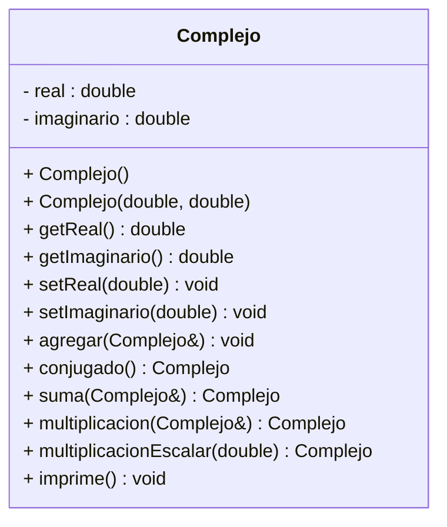

# Ejercicio-Autograding para C++ usando Catch2

**Fuente:** *Learning Autograding with C/C++ and Catch2 - Prof. Igor Machado Coelho* 
https://medium.com/swlh/easy-c-autograding-on-github-classroom-with-catch2-106ad1107402

## Descripción del Problema

Se realizará la actividad diagnóstica del curso, lo que te permitirá repasar lo básico que vimos en el semestre anterior. REalizarás la clase Complejo, sigue las instrucciones para su realización

## Diagrama de Clases

## Objetivo

- Busca que el código pase correctamente todas las pruebas
   * Solamente cambia los archivos permitidos para lograr este objetivo (abajo se indican las reglas específicas)
   
- Las GitHub Actions deberán presentar una palomita en verde si se han satisfecho todas las pruebas, y una cruz roja cuando alguna (o todas) las pruebas han fallado.
   * **Recomendación:** Puedes dar clic en la cruz roja para verificar cual de las pruebas ha fallado (o si el código no ha compilado correctamente).
   * **Recomendación:** En caso de que el Autograding no muestre pruebas o no funcione, contacta a tu profesor mediante un issue.

## Instrucciones

### Clase Complejo

- El constructor por default crea el complejo con los atributos real e imaginario en 0.
- El constructor con parámetros recibe los datos necesarios para inicializar los atributos.
- Implementa los métodos modificadores y de acceso para las dos atributos.
- El método **agregar**, modifica las variables de instancia de este objeto, agregando los valores del objeto que recibe como parámetro. Por ejemplo, si a un objeto que tiene los valores (3+2i) 3 en real y 2 en imaginario, le aplicamos el método agregar y el parámetro es el complejo (4+3i), al finalizar el método, nuestro objeto habrá modificado sus atributos a 7 en real y 5 en imaginario.
- El método **conjugado**, devuelve un nuevo Complejo que corresponde al conjugado de este objeto. Por definición matemática, el conjugado de un número complejo (A+Bi) es (A-Bi). Por ejemplo, si el objeto al cual le apliquemos el método representa el complejo (5-12i) es decir tiene los atributos 5 en real y -12 en imaginario, el conjugado de ese complejo es 5+12i
- El método **suma**, recibe como parámetro un objeto Complejo y devuelve un nuevo Complejo que representa el resultado de la suma de este objeto, con el objeto que se recibe como parámetro. La definición matemática de suma de números complejos es la siguiente:
Sean dos números complejos A + Bi  y C +Di la suma de éstos será: (A+C) + (B+D)i
Por ejemplo: la suma de estos dos complejos 3+5i y 5-12i será: 8-7i
- El método **multiplicacion**, recibe un objeto Complejo y devuelve un nuevo Complejo que representa el resultado de la multiplicación de este objeto, con el objeto que se recibe como parámetro. La definición matemática de multiplicación es la siguiente:
Sean dos números complejos A + Bi  y C +Di,  la multiplicación de éstos será: (A*C-B*D)+(A*D+B*C)i
Por ejemplo: la multiplicación de estos dos complejos 3+5i y 5-12i será: 75 – 11i
- El método **multiEscalar**, recibe un double y devuelve un nuevo Complejo, resultado de multiplicar este objeto por el número recibido como parámetro. La definición matemática para esta operación es la siguiente:
Sean un número complejo C +Di la multiplicación de éste con un número x será lo siguiente: (C*x) +(D*x)i
Por ejemplo: la multiplicación de 5-12i por 2 será: 10-24i
- El método **imprime**, desplegará a pantalla el objeto con el siguiente formato:
(A + Bi) ó (A – Bi) si es que la parte imaginaria es negativa.
    **Nota:** Los paréntesis es parte del string y SI debe llevar el signo.

- Deberás modificar SOLAMENTE el archivo `Complejo.cpp` !
  * En el archivo `Complejo.cpp` coloca tus implementaciones.

Explicación de los otros archivos:

- Archivo `test/tests.cpp` tiene las pruebas de esta actividad (NO LO CAMBIES!)
- Archivo `test/catch.hpp` tiene la biblioteca de pruebas  CATCH2 (NO LA CAMBIES!)
- Archivo `makefile` tienes los comandos para ejecutar la actividad (NO LO CAMBIES!)
- Archivo  `./build/appTests` se generará después de compilar (para **pruebas locales**, solo ejecútalo)

## Comandos para pruebas locales, ejecución y depuración

- Comando para construir y ejecutar pruebas: `make` o `make test`
    * Si el ejecutable ya está construido, sólo teclea : `./build/appTests`

- Comando para construir y ejecutar la aplicación: `make run` 
    * Si el ejecutable ya está construido, sólo teclea : `./build/exercise`

- Comando para depurar: `make debug`
    * Para conocer los comandos de depuración consulta:
     https://u.osu.edu/cstutorials/2018/09/28/how-to-debug-c-program-using-gdb-in-6-simple-steps/
     
- Comando para depurar con `vsCode` en `GitPod`: `make debugvs` 
    * Utilizar el depurador de la IDE.     

## Notas

- El código será evaluado solamente si compila.
   * La razón de esto es, si no compila no es posible generar el ejecutable y realizar las pruebas.

- Algunos casos de prueba podrían recibir calificación individual, otros podrían recibir calificación y si pasan todos juntos (o todas las pruebas en conjunto).

- La calificación final se otorgará de manera automática en cada *commit*, y se evaluará solamente hasta la fecha limite de la actividad.

Para dudas adicionales, consulta a tu profesor.

## License

MIT License 2020
